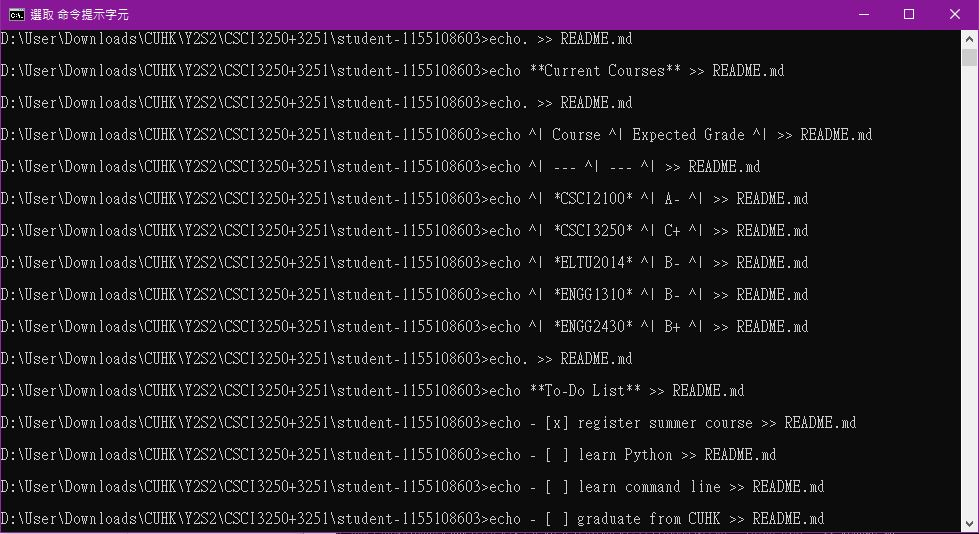

# **Lee Kwan Hung** 
 
I am a new programmer. I am also new to GitHub. 
 
**Programming Languages** 
* C 
* Java
 
**Current Courses**
 
| Course | Expected Grade | 
| --- | --- |
| *CSCI2100* | A- | 
| *CSCI3250* | C+ |
| *ELTU2014* | B- |
| *ENGG1310* | B- |
| *ENGG2430* | B+ |
 
**To-Do List** 
- [x] register summer course 
- [ ] learn Python 
- [ ] learn command line 
- [ ] graduate from CUHK 

**Screenshots** 

